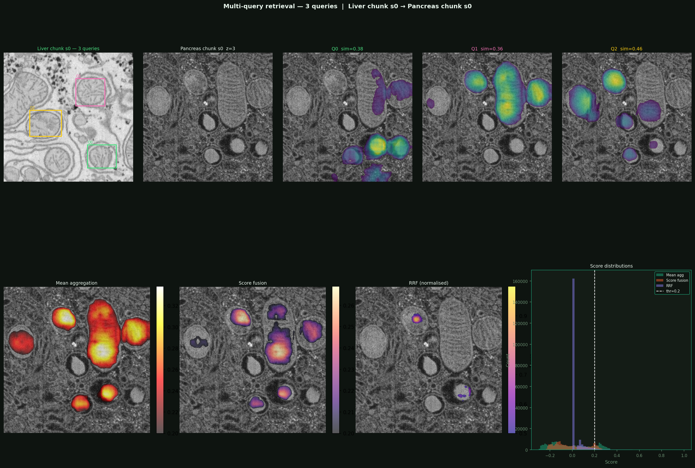

# DINOchondria

[](https://opensource.org/licenses/MIT)
[](https://www.python.org/downloads/)

**DINOv3-powered mitochondria segmentation and within/cross-dataset multiquery retrieval.**

Think of this project as a highly intelligent search engine and highlighter for biologists. 

Cells contain tiny ***"powerhouses"*** called mitochondria. When scientists look at microscopic images of cells, finding, outlining, and comparing these mitochondria across thousands of images is a massive, time consuming chore.

**DINOchondria** solves this using a state-of-the-art AI model (DINOv3) a self-supervised vision transformer. It does two main things:
1. **Segmentation:** It automatically acts like a digital highlighter, perfectly outlining the mitochondria in any given image.
2. **Retrieval:** If you show the AI a specific mitochondrion, it can search through massive databases of other cell images (even from entirely different labs or datasets) to find identical or visually similar mitochondria.


<div align="center">

|🌟 A Glimpse of What Can Be Done|
|:-----:|
||
|<p><em>Example of multi-query mitochondria retrieval and visualization.</em>|
</div>


## ✨ Key Features

* **Zero-Shot Segmentation:** Outlines mitochondria accurately with minimal to no manual training data, thanks to DINOv3's rich visual understanding and embedding extraction.
* **Multi-Query Retrieval:** Search for multiple biological structures at the exact same time to find complex patterns.
* **Cross-Dataset Matching:** Query on Dataset A, and successfully retrieve matching structures in Dataset B, overcoming standard domain-shift issues.
* **Accessible Pipeline:** Designed a research pipeline so that you do not need to be an AI expert to run the search and segmentation on your own biological image folders.

## 📝 Assessment Note: HHMI-AI Engineer

**This repository contains the completed coding assessment for the HHMI - AI Engineer position.
### - ***TASK 1:*** You can find the [**Task 1 Folder**](src/task1), [**Task 1 Instructions**](src/task1/instructions.md) and my [**Task 1 answers**](src/task1/task1_ans.md).**
### - ***TASK 2:*** You can find [**Task 2 Folder**](src/task2), [**Task 2 Questions**](src/task2/task.md) and my [**Task 2 Answers**](src/task2/task2_ans.md).**

## 2. Summary Overview

This project implements an end to end AI pipeline for feature extraction and retrieval visualization. The workflow consists of the following stages:

1. **Data Ingestion**: Downloads and extracts datasets available in the [OpenOrganelle repository](https://openorganelle.janelia.org/organelles/mito).
2. **Base Model Preparation**: Loads a customized DINOv3 model, which acts as the AI's "eyes," understanding the microscopic images pixel by pixel rather than just looking at the whole picture.
3. **Within-dataset retrieval**: Visualizes how a specific "query" mitochondrion compares to others within the *same* dataset to find highly similar structures.
4. **Cross-dataset retrieval**: Tests the AI's ability to take a mitochondrion from one dataset and successfully find matching ones in an entirely *different* dataset (demonstrating how well it adapts to images from different labs or microscopes).
5. **Multiple queries**: Combines several examples of mitochondria into a single, smarter search to find complex biological patterns or highly specific structures across the images.


## 🚀 Getting Started

### Prerequisites

You will need Python installed on your computer, along with PyTorch for the AI models. 

* Python 3.10+
* PyTorch 2.0+
* uv (Python package manager)
* CUDA-compatible GPU or Apple MPS (Highly recommended for speed)

### ⚙️ Installation

Follow these steps to get the project running on your own machine.

```bash
# 1. Download the code to your computer
git clone https://github.com/captainKLSH/HHMI_Janelia_AI_Engineer

# 2. Open the project folder
cd HHMI_Janelia_AI_Engineer

# 3. Install the required background tools and libraries
pipx install uv #(If you don't already have uv installed )
uv init
uv sync #(Recommended for easy and fast synchronize to project's virtual environment)

#Traditional aproach
pip install -r requirements.txt
```
### 🏛️ Model Architecture

- **Base Model**: DINOv3 ViT-S/16 distilled	21M parameter	trained on:LVD-1689M
- **Input Size**: 2x3x448x448 [Batch x Channel x Height x Width] (Flexible, patch-based inference supported)
- **Embedding Dimension**: 384 (Per-pixel feature vector size used for retrieval)
- **Retrieval Metric**: Cosine similarity on L2-normalized embeddings (ensures scale-invariant matching across different datasets)
- **Inference Strategy**: 3D sliding window with overlap (seamlessly processes massive biological volumes without overwhelming GPU memory)

## 📝 3. Project Repository Structure
```
📦HHMI_Janelia_AI_Engineer
 ┣ 📂OUTPUT                # Final generated results, visualizations, and summary reports
 ┃ ┣ 📂crossretrive        # Images/data from the cross-dataset matching
 ┃ ┣ 📂multiquery_viz      # Visualizations of multiple simultaneous queries
 ┃ ┣ 📂pca                 # Dimensionality reduction charts for the embeddings
 ┃ ┣ 📂retrival            # Images from the within-dataset search
 ┃ ┣ 📜inputdata_summary.txt
 ┃ ┣ 📜model_summary.txt
 ┃ ┣ 📜model_summary_hf.txt
 ┃ ┗ 📜withinRet.json      # Raw JSON data of the retrieval results
 ┣ 📂artifacts             # Intermediate files generated during runs (e.g., downloaded data, saved weights)
 ┃ ┣ 📂data_ingestion      
 ┃ ┣ 📂models              
 ┃ ┃ ┣ 📂Hugweights        # Model weights downloaded from Hugging Face
 ┃ ┣ 📂retri_viz           
 ┣ 📂config                # Configuration files to control the pipeline's behavior
 ┃ ┗ 📜config.yaml         # Master settings (file paths, model parameters, etc.)
 ┣ 📂frontend              # Code for a user interface (only applicable after training)
 ┣ 📂logs                  # Running logs to track execution and debug errors
 ┃ ┗ 📜running_logs.log
 ┣ 📂research              # Jupyter Notebooks used for initial testing and prototyping
 ┃ ┣ 📜01_data_ingestion.ipynb
 ┃ ┣ 📜02_modelbuild.ipynb
 ┃ ┣ 📜03_retrival_visualization.ipynb
 ┃ ┣ 📜04_crossretrival.ipynb
 ┃ ┗ 📜05_multiquery.ipynb
 ┣ 📂src                   # Main source code for the project
 ┃ ┣ 📂task1               # Written answers and instructions for Assessment Task 1
 ┃ ┃ ┣ 📜instructions.md
 ┃ ┃ ┣ 📜task1_ans.md
 ┃ ┣ 📂task2               # Core codebase for Assessment Task 2
 ┃ ┃ ┣ 📂components        # The main logic blocks for each step of the AI process
 ┃ ┃ ┃ ┣ 📜__init__.py
 ┃ ┃ ┃ ┣ 📜cross_retrival.py
 ┃ ┃ ┃ ┣ 📜data_ingestion.py
 ┃ ┃ ┃ ┣ 📜modelbuild.py
 ┃ ┃ ┃ ┣ 📜multiquery.py
 ┃ ┃ ┃ ┗ 📜within_retrival.py
 ┃ ┃ ┣ 📂config            # Code to read and manage the config.yaml file
 ┃ ┃ ┃ ┣ 📜__init__.py
 ┃ ┃ ┃ ┗ 📜configuration.py
 ┃ ┃ ┣ 📂constants         # Fixed project variables (like file paths)
 ┃ ┃ ┃ ┗ 📜__init__.py
 ┃ ┃ ┣ 📂entity            # Custom data structures to pass information between steps
 ┃ ┃ ┃ ┣ 📜__init__.py
 ┃ ┃ ┃ ┗ 📜config.py
 ┃ ┃ ┣ 📂pipeline          # Scripts that string the components together into runnable stages
 ┃ ┃ ┃ ┣ 📜__init__.py
 ┃ ┃ ┃ ┣ 📜stage1.py       # Runs data ingestion
 ┃ ┃ ┃ ┣ 📜stage2.py       # Runs model building
 ┃ ┃ ┃ ┣ 📜stage3.py       # Runs within-dataset retrieval
 ┃ ┃ ┃ ┣ 📜stage4.py       # Runs cross-dataset retrieval
 ┃ ┃ ┃ ┗ 📜stage5.py       # Runs multi-query retrieval
 ┃ ┃ ┣ 📂utils             # Helper tools used across the project (e.g., reading/writing files)
 ┃ ┃ ┃ ┣ 📜__init__.py
 ┃ ┃ ┃ ┗ 📜common.py
 ┃ ┃ ┣ 📜__init__.py
 ┃ ┃ ┣ 📜task.md           # Instructions for Task 2
 ┃ ┃ ┗ 📜task2_ans.md      # Written answers for Task 2
 ┣ 📜.gitignore            # Tells Git which files to ignore (like large datasets or weights)
 ┣ 📜.python-version       # Specifies the exact Python version required
 ┣ 📜README.md             # The main documentation page
 ┣ 📜annotations.json      # Metadata or labeling data for the images
 ┣ 📜dvc.yaml              # Data Version Control file to track large datasets
 ┣ 📜main.py               # The single entry point to run the entire pipeline
 ┣ 📜params.yaml           # Hyperparameters for the AI model
 ┣ 📜pyproject.toml        # Modern Python package configuration file
 ┣ 📜requirements.txt      # List of standard Python libraries needed to run the code
 ┣ 📜setup.py              # Script to install the 'src' folder as a local package
 ┣ 📜template.py           # A script to automatically generate this folder structure
 ┗ 📜uv.lock               # Dependency lock file (ensures exact library versions are used)
```
## 💻 How to Use It

Here is a simple example of how to use the code to outline mitochondria and search for similar ones.