# AI Engineer — Microscopy Image Analysis (MIA-AI)

## Take-Home Technical Challenge
### Background

3D electron microscopy (EM) datasets provide rich structural information about brain wiring. Segmenting neurons and their ultrastructure, particularly organelles such as mitochondria, is a key challenge in building connectome datasets. This challenge explores working with state-of-the-art EM image data alongside modern self-supervised learning (SSL) models, specifically DINO.

## Task 1 — Data Acquisition

### 📥 How Data Ingestion Works

The `DataIngestion` script acts as a efficient delivery service for the AI pipeline. The microscopic cell datasets from [OpenOrganelle](https://openorganelle.janelia.org/organelles/mito) are incredibly large—often terabytes in size and stored on cloud servers (Amazon S3). 

Instead of forcing the computer to download the entire massive dataset, this code smartly targets, slices, and extracts only the specific 3D microscopic chunks required for the task.

**1. Setting the Target (Initialization)**
When the process begins, the script reads a set of instructions [config.yaml](../../config/config.yaml). This configuration acts like a map, providing the web address of the cloud storage, the destination folder on the local computer, Specify chunk and the exact X, Y, and Z coordinates from [params.yaml](../../params.yaml) of the 3D cell block we want to extract.

Choosing chunk is essential cause initial chunks such as s0,s1 has higher resolution as we go go futher quality decreases but s0 has more voxel volume than subsequent ones. [Read about datasets here](https://open.quiltdata.com/b/janelia-cosem-datasets).

**2. The Download (`download_file`)**
* **Checking Local Inventory:** Before using internet, the code first checks if the requested cell chunk has already been downloaded to the computer. If it is there, it skips the download process entirely to save time.
* **Connecting to the Source:** If the file is needed, the script connects directly to the public cloud database.
* **Precision Slicing:** Rather than downloading the whole dataset and cropping it later, the code applies our X, Y, and Z coordinates directly to the cloud server using [fib_semtools](https://github.com/janelia-cellmap/fibsem-tools). It acts like a digital cookie-cutter, isolating just the 3D area we care about.
* **Saving for Speed:** It pulls that specific chunk into memory and saves it locally as a `.npy` (NumPy) file. This specific file format is optimized for speed, allowing the DINOv3 AI model to read the image data almost instantly later in the pipeline.
* **Logging:** It records the metadata and details of the download into a text file so we have a permanent record of what was extracted.

**3. Inspecting the Delivery (`data_dim`)**
Once the file is safely on the computer, the script runs a quick inspection. It peeks at the file without fully loading the massive image into the computer's active memory. It calculates and [logs](../../OUTPUT/inputdata_summary.txt) :
* **Shape:** The physical dimensions of the 3D block.
* **Total Elements:** The exact number of data points (voxels) making up the image.
* **Memory Size:** How many Megabytes the chunk occupies.

## Task 2 — Feature Extraction with DINO

### 1. *Patch size selection*: Which patch size is best suited to capture mitochondrial ultrastructure in the embeddings? Justify your choice.

- ***16x16*** (dictated by the specific DINOv3 ViT-Small plus) This is confirmed by the `kernel_size` in the [model summary](../../OUTPUT/model_summary.txt) generated during the model build.
- When analyzing Electron Microscopy (EM) datasets, mitochondrial ultrastructures such as cristae folds, the mitochondrial matrix, and the double-membrane boundary—are exceptionally fine, often spanning just a few pixels at standard nanometer-per-voxel resolutions like (8, 8, 8) voxel size (nm) for Mouse Liver set. A smaller patch size is strictly necessary to prevent these micro-structures from being averaged out into the surrounding background noise.
- While we cannot manually change the patch dimension of a pre-trained model's weights, we can control the resolution and stride:
- we can work around by choosing input image resolution pefectly matching patch size. E.g: patch size here is 16, so find a image resolution which is perfectly divisible by 16 without remainders.
- To increase patch size (`for speed`) we down sample image before sending it through model, for smaller patch size for (`higher acuity`) we upsample the image.
- Other options is to add padding to increase image size artificially using this principle formula $\frac{(Input size+(2*padding)-patch size)}{stride}+1$
- We can use overlapping patches by changing stride using $\frac{inputsize-patchsize}{stride}+1$. We can generate denser, overlapping patches by reducing the stride, effectively increasing resolution without altering the pre-trained 16x16 weights.

### 2. *Dense embeddings:* Propose a method for obtaining dense, per-pixel (or per-voxel) embeddings rather than per-patch embeddings. Implement your proposed method and compute dense embeddings for both datasets.

- ***Proposed Method: Token Reshaping and Bilinear Interpolation*** 
- Vision Transformers like DINOv3 process inputs as discrete patches, inherently outputting a flat 1D sequence of embeddings rather than a dense image map. To achieve dense, per-pixel (or per-voxel) embeddings required for precise semantic retrieval, we must map these patch level features back to the original image coordinate space.
- The proposed method involves intercepting the model's final hidden state, filtering non-spatial data, and mathematically upsampling the remaining tokens.
- In our experimentation, input size is *(448,448,448)*, patch size is *16* and model has *384* embeddings these can be interpreted while building model and summary is generated along with it. You can adjust the input size in [params.yaml](../../params.yaml) under `input_size_test` to observe how the data flow and parameters adapt.
- Our 448 2D  slice generates ($\frac{448}{16} = 28$) 28 x 28 patches, Flattening it we get 784 spatial vector with 1 [CLS] token and 4 register token.
- **Tokenization**: we have 789 sequence tokens each with 384D embedding keeping pixel co-ordinates in memory injected via RoPE(**Ro**tary **P**ositional **E**mbeddings )
- These passes through 12 dense tranformer layer, updating each 384D embedding with description and context awareness.
- At the end, we keep the 784 pixels and discard 5 special tokens, 784 pixels is interpolated(upsampled) back to original image size ($784$ --> $28 \times 28$ --> $448 \times 448$)
- ***We have a high-resolution map where every single pixel has its own brilliant 384-number biological fingerprint!***

- **Other methods for extraction:**
    - **Multi-Layer Feature Concatenation (Similar method proposed in [DinoV3 paper](https://arxiv.org/abs/2508.10104)):** 
        - Instead of just the last layer, you take the outputs from the last 4 layers and stack them together.
        - We extract layers 9, 10, 11, and 12. we can either average them or concatenate them into a much larger vector (e.g., $384 \times 4 = 1536$ dims).
        - Early layers capture edges and textures (the cristae lines, cell wall), while later layers capture object identity (the whole mitochondrion).
    - **Multi-Scale Inference:**
        - We run the same image through the model at two different resolutions (e.g., $224 \times 224$ and $448 \times 448$) and interpolate the features to match.
        - we get a "*Zoom-In / Zoom-Out*" perspective. This helps significantly if our datasets have different nanometer resolutions.

# Task 3 — Embedding-Based Retrieval & Visualization

### 1. *Within-dataset retrieval:* Visualize how the query mitochondrion's embeddings compare to the embeddings of other mitochondria *within* each dataset.
- To perform within-dataset retrieval, we leverage the dense, high-dimensional embeddings extracted from the DINOv3 model. Because the model groups semantically similar biological structures closely together in its embedding space, pixels belonging to mitochondria share highly correlated mathematical signatures.
- To visualize and quantify how a query mitochondrion compares to others in the same dataset, I developed a [WithinDatasetRetrival](./components/within_retrival.py) pipeline that performs mean-pooled querying, cosine similarity heatmapping, and quantitative evaluation.
    - Selecting a single pixel as a query can introduce noise. Instead, we define a bounding box `[y_min:y_max, x_min:x_max]` defined in [params.yaml](../../params.yaml) around a prominent target mitochondrion in a specific Z-slice.
    - The embeddings of all pixels within this Region of Interest (ROI) are averaged (mean-pooled) and L2-normalized. This creates a highly robust, `master` query vector for mitochondrial structure.
    - We compute the *Cosine Similarity* between our normalized query vector and flattened embedding matrix representing every other pixel in the dataset volume.
    - The dot product yields a full similarity map for the entire image space, ranging from -1.0 (opposite) to 1.0 (identical).
    - To quantitatively prove that the embeddings successfully capture the target, the pipeline calculates `Precision@k`, `Recall@k`, and an `F1 score`.
    - We treat pixels inside our initial bounding box as the ground truth positive mask. By ranking all pixels in the image by their similarity score, we can evaluate how many of the `top k` most similar pixels correctly correspond to the target mitochondrial structure, establishing a baseline accuracy for the retrieval system.
    - To visually analyze retrieval performance, the pipeline generates a comprehensive 4-panel dashboard:
        - *Raw EM Slice*: Displays the base microscopic image with the target query bounding box highlighted.
        - *Full Similarity Heatmap*: A full view of the raw cosine similarity scores. Mitochondria in the entire slice are activate with high correlation, while the cytoplasm and background remain different.
        - *Thresholded Overlay*: A localized view that masks all similarity scores below a designated threshold, visually isolating only the strongest semantic matches overlaying the raw data
        - *Score Distribution*: A histogram mapping the frequency of the cosine similarity scores, allowing us to empirically select the optimal cutoff threshold to separate signal (i.e, mitochondria) from noise (i.e, background)
- ***NOTE: Please find the [visualization output images in here](../../OUTPUT/retrival/)***

<h3>🔍 Visual Proof of Semantic Understanding</h3>

|||
|:-----:|:-:|
|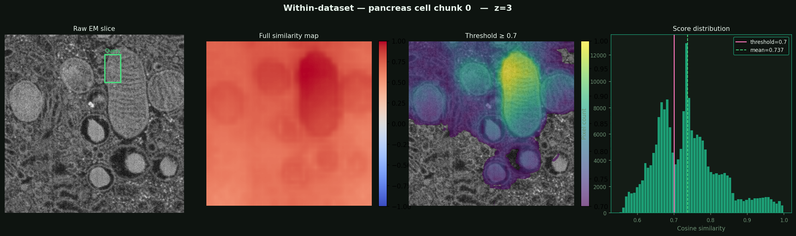|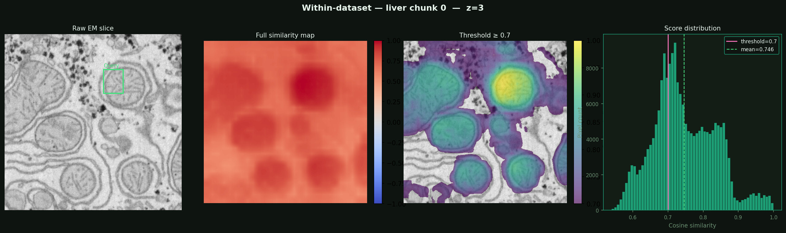|
|*Morphological Discrimination of Organelles, model understands true Pancreas mitocondrial semantics*|*capture and retrieve consistent mitochondrial ultrastructure across a mouse Liver slice*|
|||
|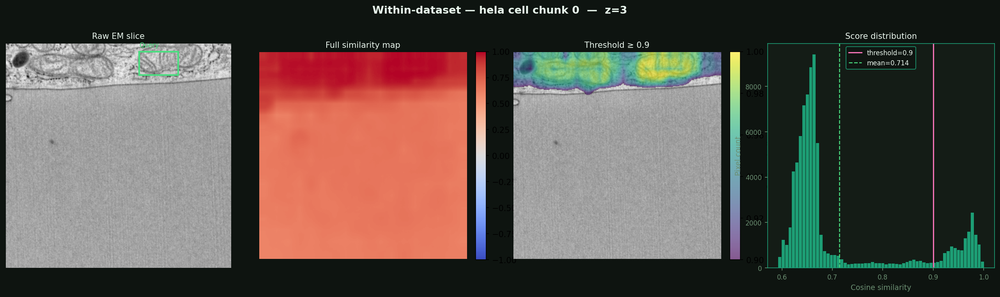|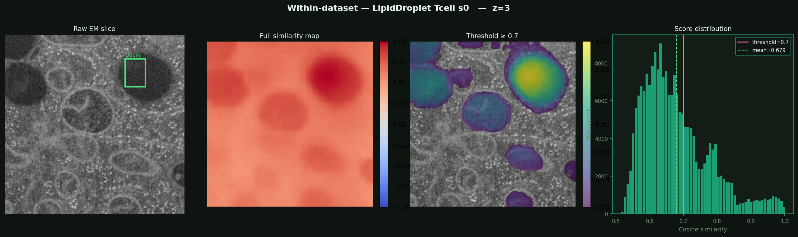|
|*High-Specificity Thresholding via Score Distribution, cleanly separate target from background.*|*Negative Set:High distinction in selecting Lipid(target) vs mitochondria(negative)*|

### 2. *Cross-dataset retrieval:* Visualize how the query mitochondrion's embeddings compare to the embeddings of mitochondria *across* the two datasets.

- Cross-dataset retrieval is significantly more challenging than within-dataset retrieval.
- Because the two datasets (e.g., [Mouse Liver vs. HeLa Cell](../../OUTPUT/crossretrive/pca_lhs0.png)) likely possess varying nanometer-per-voxel resolutions, distinct stains, and different background noise profiles, their raw embedding distributions are mathematically disjointed.
- I developed a [CrossDatasetRetrival](./components/cross_retrival.py) pipeline that implements distribution alignment, mutual nearest-neighbor grading, and cross-domain heatmapping.
    - Before cross querying, we must map both embedding spaces into a shared, diverse domain space. we achieve this via `Z-score normalization`
    - We calculate the global mean (`mu`) and standard deviation (`std`) of the full embedding volume for both Dataset 1 and Dataset 2
    - By subtracting the dataset specific mean and dividing by the standard deviation for every pixel ($\frac{pixel-mean}{std}$), we center both datasets at the origin of the embedding space with unit variance.
    - This acts as a normalizer, ensuring the query vector from Dataset 1 can accurately `speak the same language` as the gallery vectors in Dataset 2
    - To visually prove that this alignment corrects the domain shift, we plot a 2D PCA projection of the embedding space. Before alignment datasets have separate clusters, After alignment distributions overlap.
    - To mathematically evaluate the quality of the cross-dataset matching, calculate the (Mutual Nearest Neighbor)MNN Rate.
    - For a selected mitochondrion in Dataset 1, it finds the closest match in Dataset 2. It then reverses the query. If both mitochondria independently select each other as their top match across the domain, it is recorded as a mutual match.
    - high MNN rate proves the embeddings are highly specific and biologically robust.
    - we generate a same 4-panel dashboard from above to visualize query retrival

> [!NOTE] ***Please find the [visualization output images in here](../../OUTPUT/crossretrive/)***

<h3>🔍 Visual Proof of Overcoming Domain Shift in Feature Space and Cross-Dataset Semantic Retrieval</h3>

|||
|:-----:|:-:|
|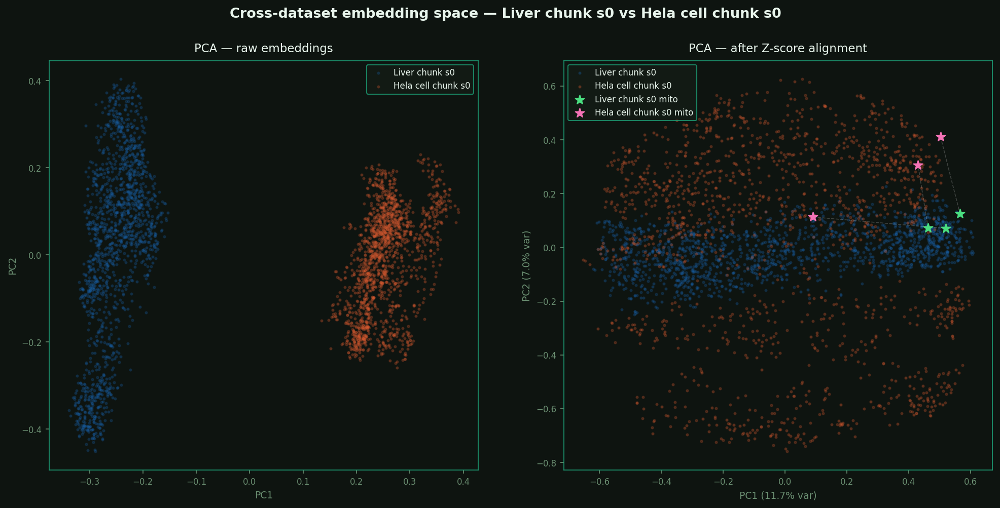|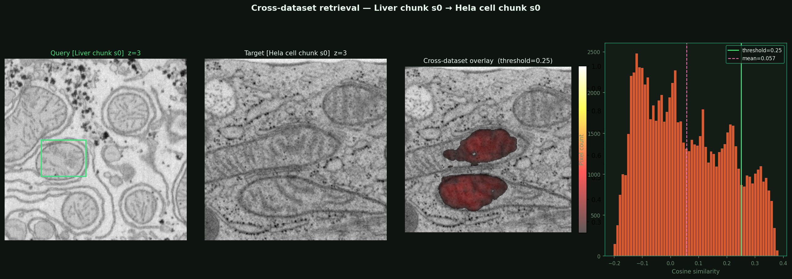|
|*PCA Visualization of Domain Shift and Z-Score Alignment (Liver mitochondria and HeLa mitochondria slices)*|*Cross-Dataset Target Isolation (Liver mitochondria Query -> HeLa mitochondria Target)*|
|||
|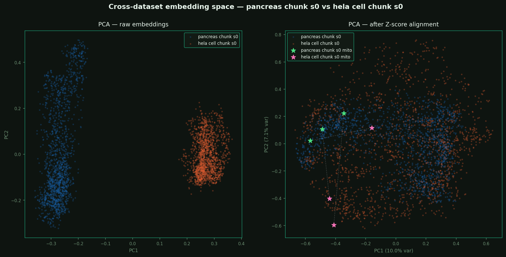|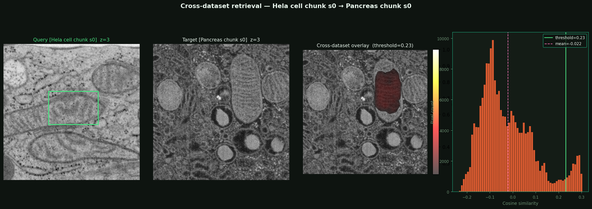|
|*PCA Visualization of Domain Shift and Z-Score Alignment (Pancreas mitochondria and HeLa mitochondria slices)*|*Cross-Dataset Target Isolation (HeLa mitochondria Query -> Pancreas mitochondria Target)*|
|||
|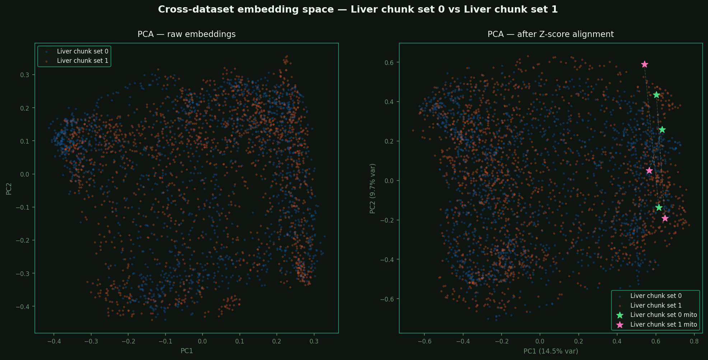|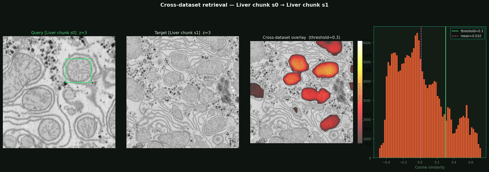|
|*PCA Visualization of Domain Shift and Z-Score Alignment (Liver mitochondria chunk1 and Liver mitochondria chunk2 slices)*|*Cross-Dataset Target Isolation (Liver mitochondria chunk1 Query -> Liver mitochondria chunk2 Target)*|
|||
|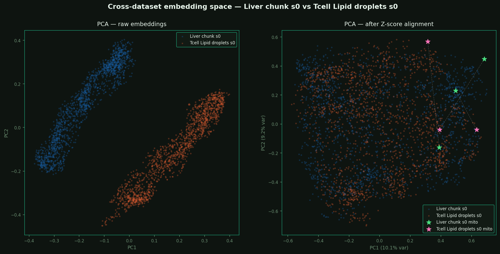|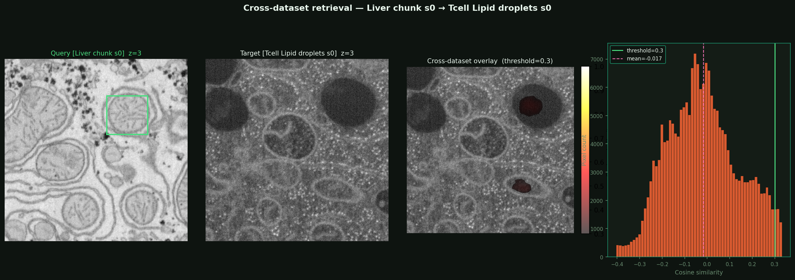|
|*Negative Set: PCA Visualization of Domain Shift and Z-Score Alignment (Liver and Lipid slices)*|*Negative Set: Cross-Dataset Target Isolation (Liver mitochondria Query -> Tcell Lipid Target)*|

### 3. *Multiple queries:* Describe how you would adapt your visualizations and retrieval strategy if you used multiple query mitochondria instead of one. What changes would you expect in the results?

- To address the high intra-class variance of mitochondria (`pleomorphism`(New word I just learned) across sectioning planes), the retrieval pipeline was upgraded to support [Multi-Query Retrieval](./components/multiquery.py).
- By selecting multiple distinct mitochondria from the source dataset to act as a support,so that the model can capture a much broader, more robust morphological distribution.
- The `MultiQueryRetrieval` class implements and quantitatively compares three distinct strategies (like ensemble methods) to handle the $N$ query vectors
    - *Mean Aggregation (Early Fusion):* We extract the vectors for all $N$ queries, average them into a single Global vector, and perform a single cosine similarity search against the target set.
    - *Score Fusion (Late Fusion):* We execute $N$ independent searches, generating $N$ distinct cosine similarity heatmaps. We then calculate the pixel-wise average across all heatmaps.
    - *Reciprocal Rank Fusion (RRF):* This is inspired from RAG systems. We generate $N$ independent ranked lists of pixels. A final fused score is assigned using the formula:( $RRF = \sum \frac{1}{rank + k}$. )RRF heavily penalizes false positives, ensuring that only pixels consistently highly ranked across multiple different queries are retrieved
    - these three methods are evaluated natively using `Precision@k`, `Recall@k`, and `F1@k` against the ground-truth annotations of the target dataset.
    - All three fusion methods demonstrated highly stable and comparable performance, validating the robustness of the preceding Z-Score domain alignment step. Mean Aggregation (Early Fusion) emerged as the optimal strategy.
    - we generate a same panel dashboard from above to visualize query retrival
- - ***NOTE: Please find the [visualization output images in here](../../OUTPUT/multiquery_viz/)***

<h3>🔍 Visual Proof of Fusion Strategies & Multi-Query Dashboard</h3>

|||
|:-----:|:-:|
|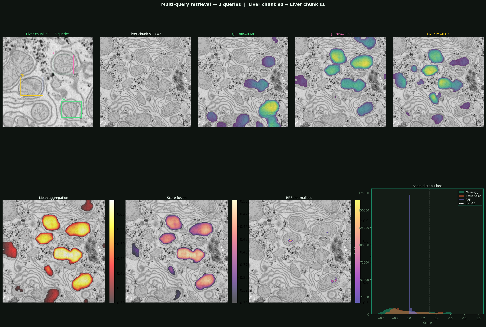|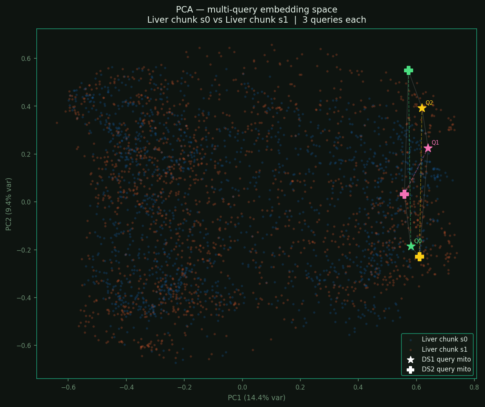|
|*Multi-Query Retrieval and Fusion Strategies (Liver mitochondria chunk0 -> Liver mitochondria chunk1)*|*Semantic Neighborhood and a multi-dimensional boundary (illustrated by the convex hull) via Multi-Query PCA*|
|||
||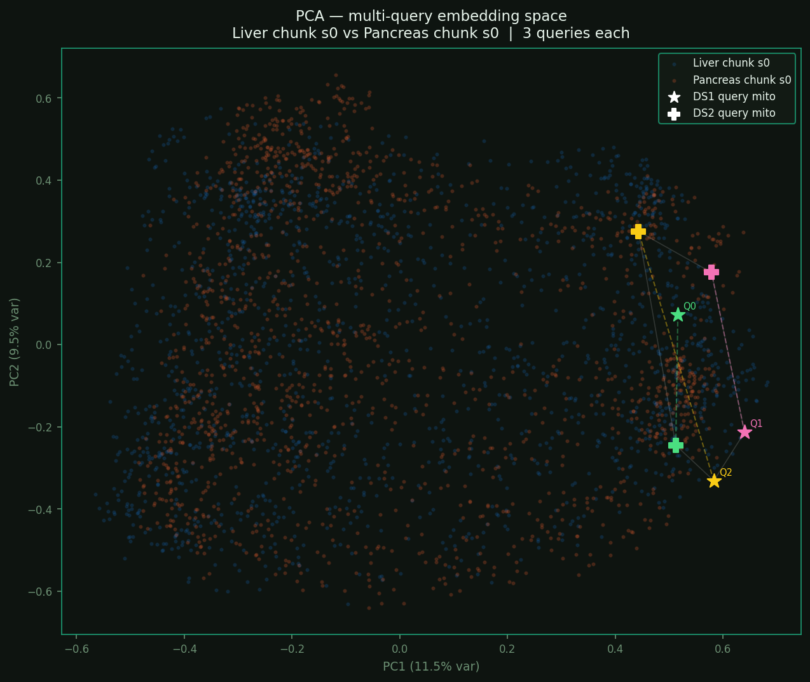|
|*Cross-Domain Multi-Query Retrieval and Fusion Strategies (Liver mitochondria -> Pancreas mitochondria)*|*Semantic Neighborhood via Multi-Query PCA*|
|||
|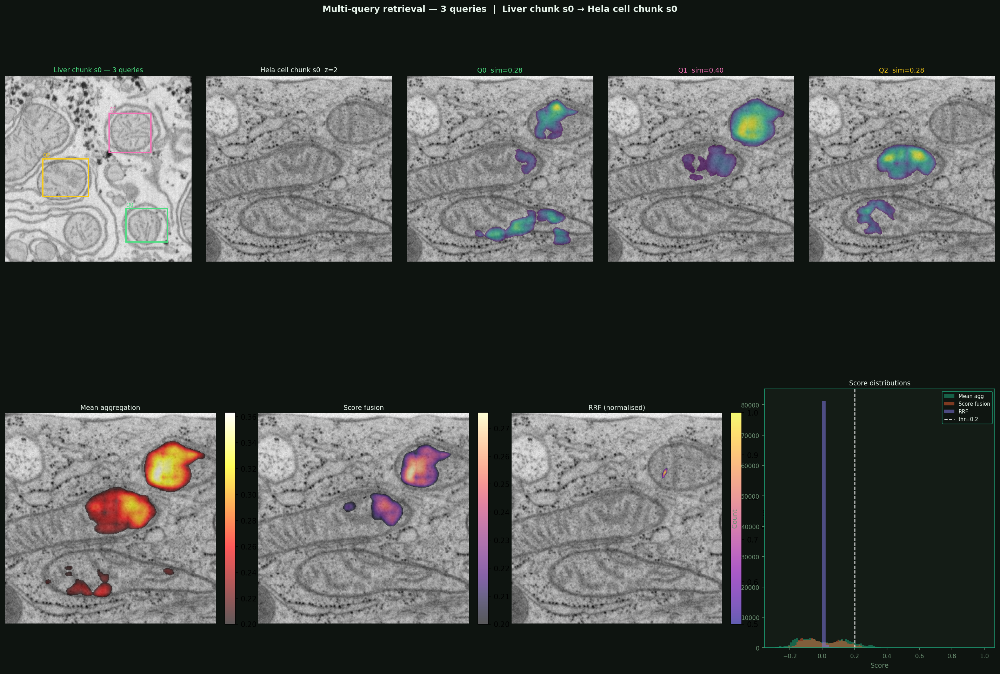|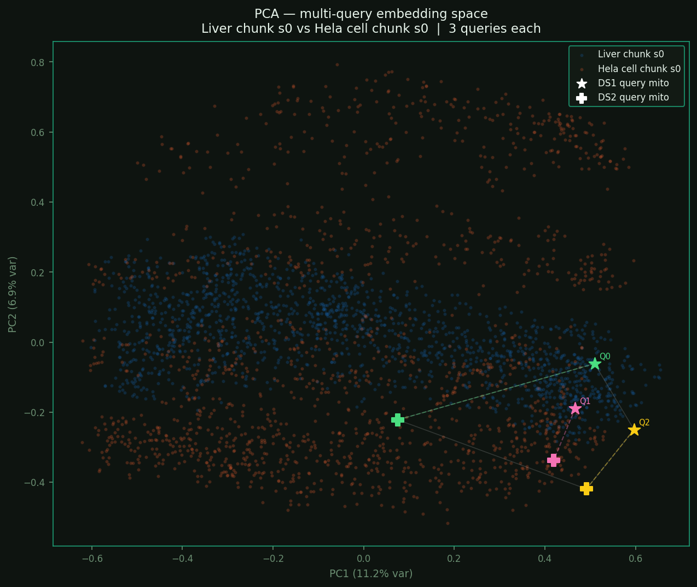|
|*Cross-Domain Multi-Query Retrieval and Fusion Strategies (Liver mitochondria -> HeLa mitochondria)*|*Semantic Neighborhood via Multi-Query PCA*|
|||
|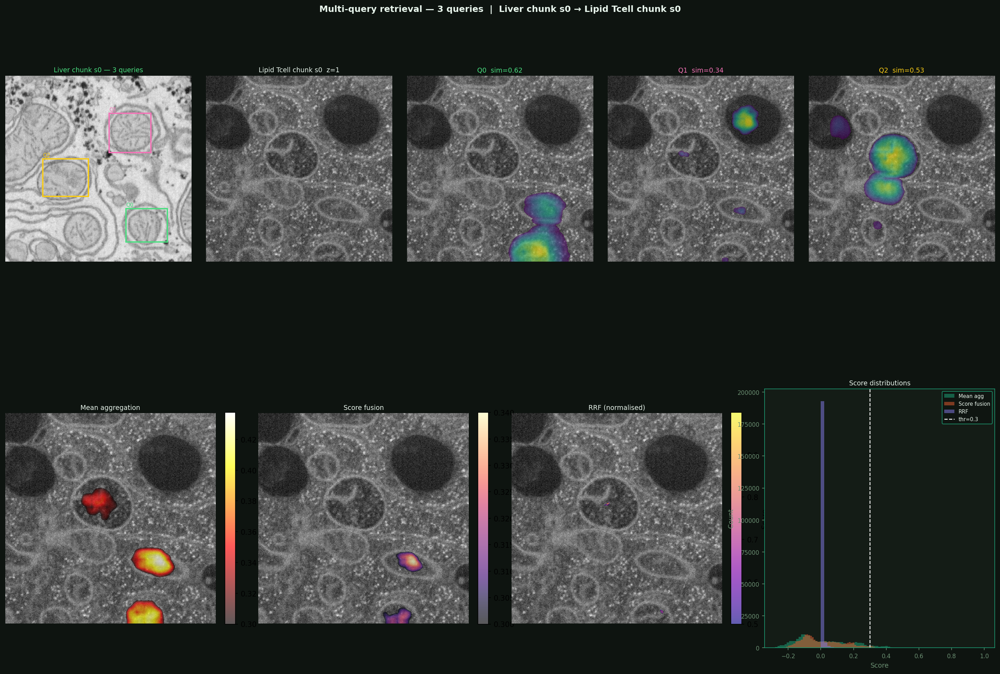|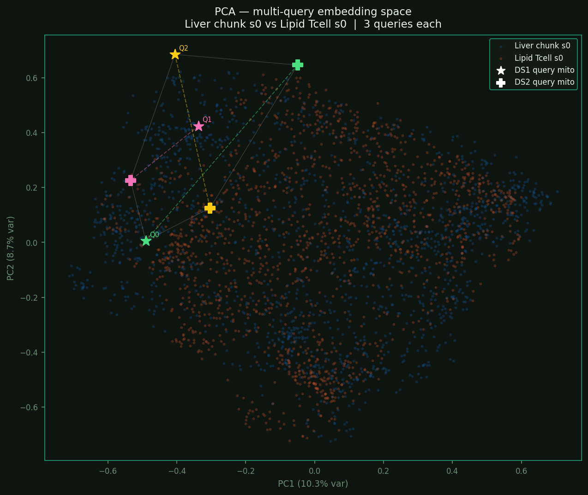|
|*Negative Set: Cross-Domain Multi-Query Retrieval and Fusion Strategies (Liver mitochondria  -> Tcell Lipid)*|*Negative Set: Semantic Neighborhood via Multi-Query PCA*|

## Task 4 — Proposal: Improving Mitochondria Detection with Minimal Fine-Tuning

- Our main objective is to adapt a pre-trained DINOv3 Vision Transformer (ViT) to the specific domain of mitochondria segmentation, minimizing computational overhead and preventing forgetting of the model's generalized feature space.

- Our previous task prove that the off the shelf DINOv3 model understands the fundamental biological semantics, Zero-shot learning can be implemented. But to completely make model completely understand biological semantics (electron microscopy noise, varying staining, specific organelle morphology) we need to use parameter efficient fine-tuning (PEFT) technique.
- DINOv3 is trained on 1.689 billion images, extracted from a pool of 17 billion public Instagram posts which are natural imagesets. However Microscopy Image images have a distinct texture and noise profile compared to the natural images.
    - **Stratergy 1:**
        - We will use [LowRank Adaptation (LoRA)](https://arxiv.org/abs/2106.09685) proven method on the last N transformer blocks, to freeze the pre trained model weights and inject trainable rank decomposition matrices into the Transformer architecture. Only the low-rank residuals are trained.
        - we target the Query (Q) and Value (V) projection matrices within the Multi-Head Attention blocks.
        - LoRA allows the attention mechanism to subtly shift its focus to EM-specific textures (like cristae gradients, mitochondrial wall thinkness) using less than 1% of the original parameter count.
        - Only the late blocks encode high level semantic context, which is where the natural image context is strongest and most harmful.Adapting only the last 2–4 blocks with rank `r = 8` adds roughly:
            - params = $2 \times r \times (din + dout) \times Nadaptedblocks \times 4projections$
            = $2 \times 8 \times (384 + 384) \times 3 \times 4$ ~ 147,000 params   (for vits16plus, 3 blocks)
        - That is 0.5% of the backbone's 28.7M parameters.
    - **Stratergy 2:**
        - we use adapter layers between encoder and decoder called **Linear Probing** (Classifier-Level Adaptation), The adapter learns a domain-specific projection that remaps the natural-image feature distribution into the Microscopy tissue image feature distribution before the decoder.
        - This is faster to converge than LoRA because there are fewer parameters and the gradient path is shorter.
    - **Stratergy 3:**
        - we run a short self-supervised fine tuning pass of the DINOv3, on your unlabelled microscopy volumes. This shifts the embedding distribution toward microscopy tissue before any segmentation training begins. Use the resulting weights as the initialisation.
        - During backpropagation, only these specific prompt tokens are updated.

- ViTs process at a single scale, but biological structures vary vastly in size. We will extract feature maps from intermediate layers (e.g., layers 3, 6, 9, and 12) to capture both high resolution edges (early layers) and deep semantic context (late layers).
- We will append a lightweight simplified U-Net style decoder. This head will consist of a few standard transposed convolutions and upsampling layers to fuse the multi-scale features and project the 384-dimensional embeddings down to a 2D binary mask
- The backbone remains 99% frozen, meaning the only fully initialized weights belong to this small decoder, making training incredibly fast.
- `Few-shot Learning:` Because we are using PEFT and a small decoder, we can achieve high performance and reducing the need for massive annotated datasets.
- Train using the AdamW optimizer with a cosine decay learning rate schedule. Only the LoRA weights and the decoder head are passed to the optimizer.
- Use *Binary Cross-Entropy (BCE)* to penalize high-confidence false positives and *Dice Loss* to handle the severe class imbalance(mitochondria only make upto a small percentage of total cell volume)
- Calculate Intersection over Union (IoU) and Pixel-wise F1-Score against ground-truth masks.
